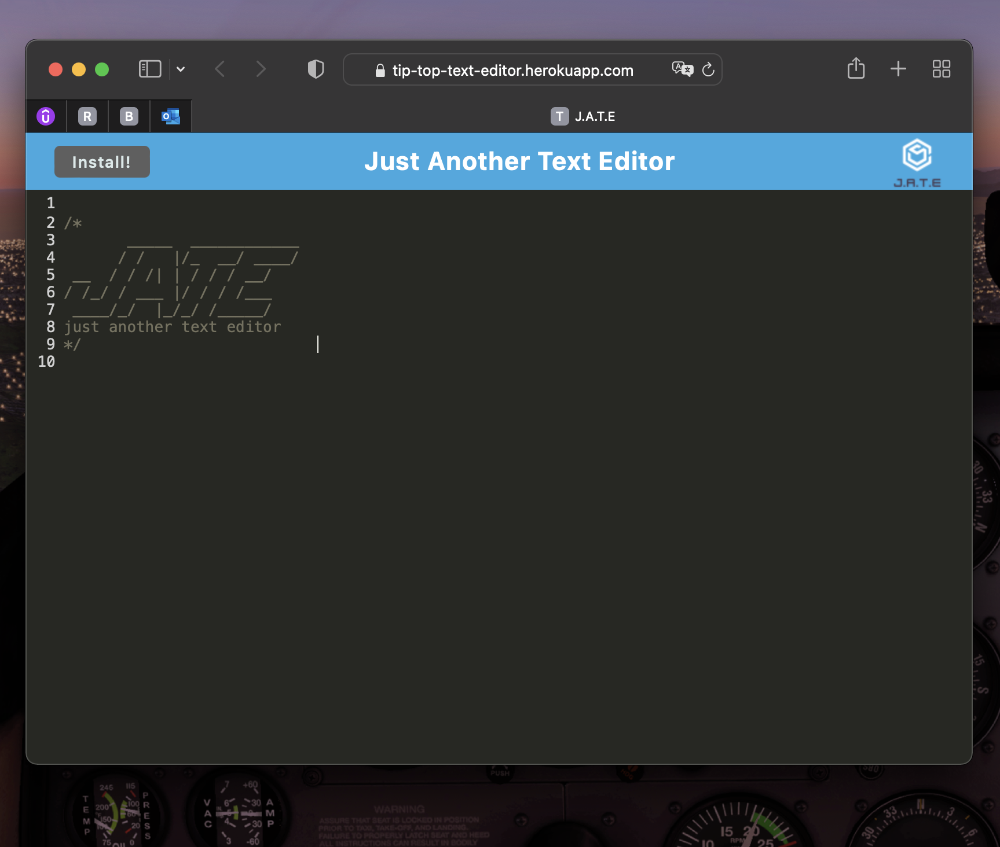

# Tip Top Text Editor

[Deployed Application on Heroku](https://tip-top-text-editor.herokuapp.com)

## Description

This is a single-page, downloadable text editor you can use offline! It features a number of data persistency techniques that serve as redundancy in case one of the options isn't supported by the browser. Users can re-access their notes on page refresh, as they are stored in a database.

## Table of Contents

1. [Installation](#installation)
2. [Usage & User Story](#usage)
3. [Contributing](#contributing)
4. [Screenshots](#screenshots)

## Installation

Run `npm i` inside each folder with a .json file to install dependencies for back-end. For front end, simply open the application deployed on Heroku and click "INSTALL" to access locally and save to your device.

## Usage

Never lose your notes again! Jot down handy thoughts or reminders to yourself, or even write a narrative. Your text will be saved locally in a database for later access, even after the application has been closed.

## User Story

```md
AS A developer
I WANT to create notes or code snippets with or without an internet connection
SO THAT I can reliably retrieve them for later use
```

## Contributing

Chandra Holt

## Screenshots




### GitHub

[Chandra's GitHub](https://www.github.com/chandrapanda)

### Email

_see profile for this information_
